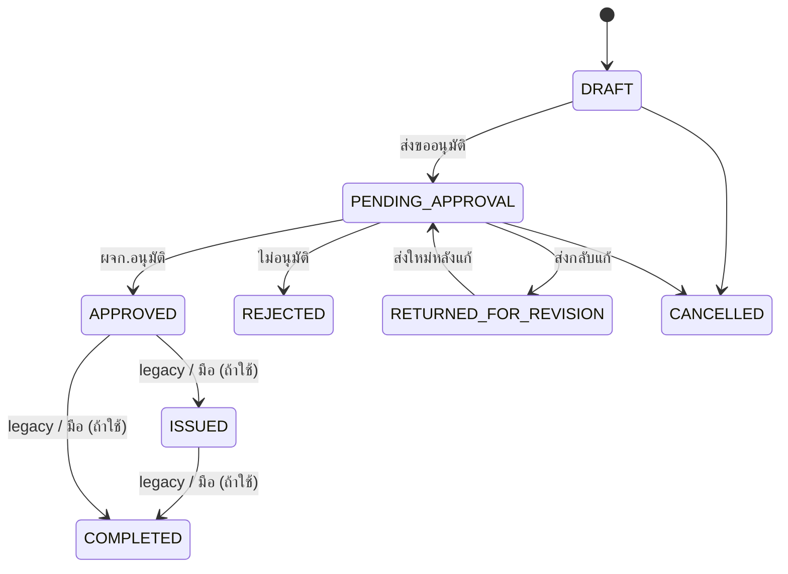

# Step 0 — นิยามเวิร์กโฟลว์ PO จัดซื้อภายใน (Purchases)

เอกสารนี้เป็นฐานให้ตรวจทานก่อนลงมือเขียนโค้ดขั้นถัดไป

## 1. ขอบเขตคำว่า “PO” ในโปรเจกต์นี้

| คำที่ใช้พูด | ความหมายใน OpsFlow (ขั้นนี้) |
|-------------|-------------------------------|
| **PO (จัดซื้อภายใน)** | เอกสารใน Firestore คอลเลกชัน `purchases` — เลขที่อ้างอิงหลักคือ `purchaseNo` |
| ใบสั่งซื้อลูกค้า (Customer PO) | คอลเลกชัน `purchase_orders` — **ไม่ใช่** ขอบเขต Step 0 ฉบับนี้ |

## 2. นิยาม “ปิด PO” (ยืนยันตามที่ตกลง)

**ปิด PO เมื่อ “จ่ายเงินครบ” ตาม PO นั้นเท่านั้น**

- เงื่อนไขปิด: ยอดที่ต้องจ่ายต่อ PO นี้ถูกชำระครบทุกงวด/ทุกยอดที่ระบบกำหนด (ในอนาคตจะ map กับ milestone / บิล / AP)
- **ไม่บังคับ** ให้ “รับของครบ” เป็นข้อกำหนดการปิด PO ในนิยามขั้นนี้ (ถ้าต้องการผูกรับของทีหลัง ให้ยกเป็น Step แยกหลัง Step 0)

สถานะในโค้ดปัจจุบันที่ใกล้เคียง “ปิด” คือ `Purchase.status === 'COMPLETED'` — ขั้นถัดไปจะผูกให้เปลี่ยนเป็น COMPLETED เฉพาะเมื่อเงื่อนไข “จ่ายครบ” เป็นจริง (ยังไม่ implement ใน Step 0)

## 3. แผนผังสถานะปัจจุบัน (โค้ดที่มี)

สถานะ `PurchaseStatus` ใน `src/lib/types.ts`:

`DRAFT` → `PENDING_APPROVAL` → (`APPROVED` | `REJECTED` | `RETURNED_FOR_REVISION`) และมี `ISSUED`, `COMPLETED`, `CANCELLED`

หมายเหตุ: transition ไป `ISSUED` / `COMPLETED` บางส่วนทำได้จาก UI แบบ legacy — จะต้องทำให้สอดคล้องนิยาม “ปิด = จ่ายครบ” ใน Step ถัดไป

## 4. พฤติกรรมที่มีและสอดคล้องความต้องการแล้ว

- **พิมพ์เอกสาร**: ใน `src/app/purchases/[id]/page.tsx` อนุญาตพิมพ์เมื่อ `status === 'APPROVED'` เท่านั้น (ยังไม่ approved = ไม่ควรออกเอกสารทางการ — ปุ่มแสดงเฉพาะเมื่อ approved)

## 5. เป้าหมายขั้นถัดไป

- **Step 1 (ทำแล้ว):** ดู [purchases-po-workflow-step1.md](./purchases-po-workflow-step1.md) — แยก APPROVED → ISSUED (ส่งคู่ค้า), ตัดปุ่มปิด COMPLETED แบบมือ, ปรับเงื่อนไขพิมพ์
- **Step 2–3 (ทำแล้ว):** [purchases-po-workflow-step2-3.md](./purchases-po-workflow-step2-3.md) — งวดชำระ + ปิด PO เมื่อครบงวด
- **Step 4 (ทำแล้ว):** [purchases-po-workflow-step4.md](./purchases-po-workflow-step4.md) — งวด ↔ ใบรับวางบิล ↔ AP ต่องวด
- **Step 5 (ทำแล้ว):** [purchases-po-workflow-step5.md](./purchases-po-workflow-step5.md) — จ่าย + cashbook + sync งวด

## 6. Checklist ผ่าน Step 0

- [x] ระบุว่า PO ในขั้นนี้ = `purchases` + `purchaseNo`
- [x] ระบุว่า ปิด PO = จ่ายเงินครบ (ไม่ผูกรับของในนิยามนี้)
- [x] บันทึกสถานะที่มีในระบบเป็นแผนภาพ
- [ ] พี่โจ้ยืนยันข้อ 2–3 (ถ้าต้องการผูกรับของภายหลัง ให้บันทึกเป็น requirement เพิ่ม)

---

*Step 0 = เอกสารและนิยามเท่านั้น — ไม่มีการเปลี่ยนโค้ดในรอบนี้*
